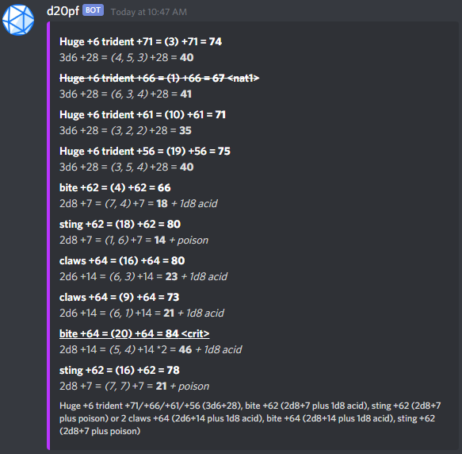
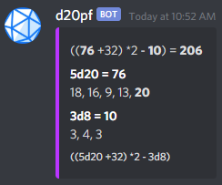

# d21cord
tabletop rpg dice parsing and rolling utility bot

# supported commands:

## pf
parses a pathfinder (e1) attack string and rolls all attack and damage rolls for you.
- crits are applied automatically
- nat1s are also applied
- attacks are rolled in order
- formatting highlights the most important parts

sample input ([source](https://www.d20pfsrd.com/bestiary/monster-listings/outsiders/devil/devils-unique/devil-lucifer-prince-of-darkness-tohc)):
> dpf Huge +6 trident +71/+66/+61/+56 (3d6+28), bite +62 (2d8+7 plus 1d8 acid), sting +62 (2d8+7 plus poison) or 2 claws +64 (2d6+14 plus 1d8 acid), bite +64 (2d8+14 plus 1d8 acid), sting +62 (2d8+7 plus poison)

## ez
parses a string for dice rolls and runs a calculation with the dice results.
- each dice is displayed seperately
- each roll is also displayed seperately
- 1s and 20s are highlighted
- diceroll results are highlighted in the final formular

sample input
> dez ((5d20 +32) *2 - 3d8)

# TODO
- ~~undo attack roll ordering and dmg accumulation~~
- stop being an idiot
- parse negative attack bonus
- ~~clean up the messy calculation code~~
- ~~sort output by attack role~~
- ~~display 1's~~
- ~~add-up current dmg (except for 1's)~~
- roll extras if they're are rollable
- ~~use markown memes in output (mainly bold)~~
- parse pathfinder2 stuff and maybe dnd
- ~~dice calculator command with dice templating, showing dice results seperately~~
- maybe scrape testcases from d20pfsrd.com
