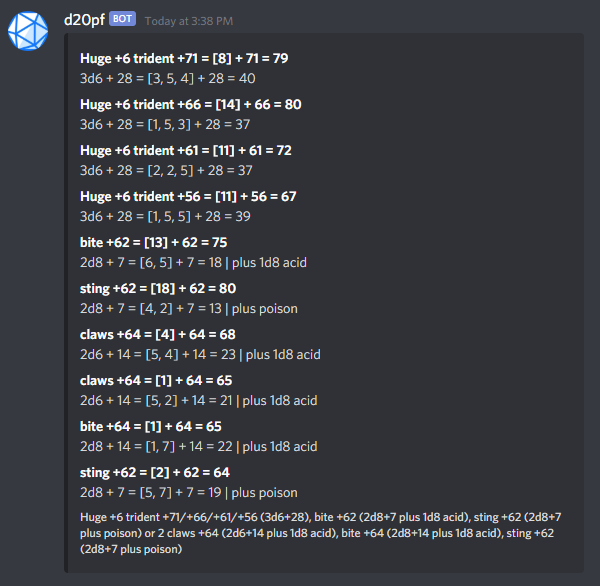

# d20pf-cord
pathfinder utility discord bot

# supported commands:

## monster
parses a monsters attack string and rolls all attack and damage rolls for you.
crits are taken into account.

sample input ([source](https://www.d20pfsrd.com/bestiary/monster-listings/outsiders/devil/devils-unique/devil-lucifer-prince-of-darkness-tohc)):
> d20pf monster Huge +6 trident +71/+66/+61/+56 (3d6+28), bite +62 (2d8+7 plus 1d8 acid), sting +62 (2d8+7 plus poison) or 2 claws +64 (2d6+14 plus 1d8 acid), bite +64 (2d8+14 plus 1d8 acid), sting +62 (2d8+7 plus poison)

# TODO
- clean up the messy calculation code
- sort output by attack role
- display 1's
- add-up current dmg (except for 1's)
- roll extra's if they are rollable
- use markown memes in output (mainly bold)
- parse pathfinder2 stuff and maybe dnd
- dice calculator command with dice templating, showing dice results seperately
- parse player attacks?
- maybe scrape testcases from d20pfsrd.com